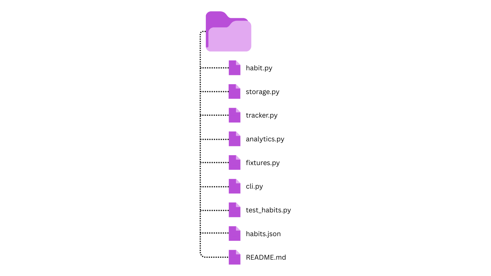
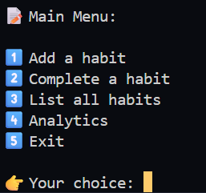
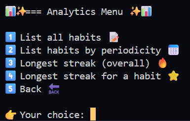

# Habit Tracker
A simple Python command-line based habit tracking application that allows users to create, track, and analyse habits.The project includes persistent storage, analytics for habit streaks, and a modular, maintainable code structure.

## Project Overview
Habit Tracker is designed to help users monitor daily, weekly, or monthly habits. Users can:
- Add new habits with a specified periodicity.
- Mark habits as completed.
- View a list of all habits or filter by periodicity.
- Analyse completion streaks for individual habits or across all habits.

The project demonstrates a modular Python design with:
- `Habit` class for individual habits
- `HabitTracker` for business logic
- `storage.py` for JSON persistence
- `analytics.py` for analytics such as streak calculation.
- `cli.py` for user interaction
- `pytest` for testing

## Features
- Habit creation - add habits with daily, weekly, or monthly periodicity.
- Completion logging - mark habits as completed with automatic timestamp.
- Analytics - longest streak per habit, longest streak across all habits, list habits filtered by periodicity.
- Persistent storage - habits and completions are saved to `habits.json`.

## Installation and run guide
### Prerequisites
- Python 3.10+
- Git (for cloning)
### Steps
1. Download the ZIP file from GitHub or clone the repository using this command: `git clone https://github.com/dianabali/habit-tracker.git`
2. Install Pytest for testing: `pip install pytest`
3. After installation, run `cli.py` directly or by running this command> `python cli.py`

Main menu options:
1. Add habit - create a new habit.
2. Complete habit - mark a habit as completed.
3. List habits - view all habits.
4. Analytics - submenu with list all habits, filter habits by periodicity, view longest streak (overall or per hbait).
5. Exit - close the app.

Analytics submenu:
1. List all habits
2. List habits by periodicity
3. Longest streak (overall)
4. Longest streak for a habit
5. Back

## Project Structure

## Preview

